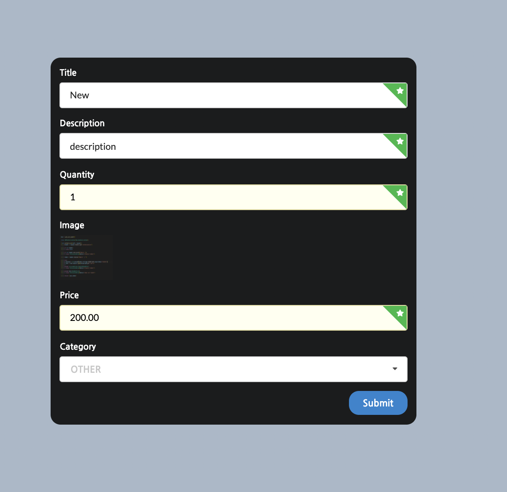

# General Assembly  Project Four, Full-stack Django, PostgreSQL, React application-E@syShopp

##  Overview
Project Four requires to use of Django with PostgreSQL as a backend server and React.js for the frontend. I decide to do this project solo. After quick thought about what I would like to build, I decided to try my strength with something I haven’t tried before and I go with the e-commerce website. 

## Time to build
### 9 days

---
### Visit E@asyShopp **[here](https://easyshopp.herokuapp.com/)**!
---

### Please feel free to log in using the following credentials:
**email**: piotr@mail.com	\
**password**: Mypassword123

## Code Installation
#### Clone or download the repo then do the following in Terminal:
- Create new PostgreSQL database `createdb final_project_db`
- Install back-end dependencies `pipenv`
- Enter Shell for the project `pipenv shell`
- Make Migrations `python manage.py makemigrations`
- Migrate `python manage.py migrate`
- Start back-end server `python manage.py runserver`
- Change into front-end directory `cd frontend`
- Install front-end dependencies `yarn`
- Start front-end server `yarn start`

## The Brief
- **Build a full-stack** application by making your own backend and your own front-end
- **Use a Python Django API using Django REST Framework** to serve your data from a Postgres database
- **Consume your API with a separate front-end built with React**
- **Be a complete product** which most likely means **multiple relationships and CRUD functionality** for at least a couple of models
- Implement thoughtful user stories/wireframes that are significant enough to help you know which features are core MVP and which you can cut
- **Be deployed online so it's publicly accessible**

## Technologies Used
### Backend:
- Python
- Django
- Django REST Framework
- Psycopg2
- pyJWT
- PostgreSQL
- Pipenv

### Frontend:
- React
- Axios
- Semantic UI React
- Http-proxy-middleware
- Nodemon
- React Router Dom
- React Toastify

### Development tools:
- VS code
- Yarn
- Insomnia
- Git
- Github
- Google Chrome dev tools
- Heroku (deployment)
- Jamboard (wireframing)
- Zoom
- Slack

## Timeline
### Planning (day 1):
As I didn’t have any experience with creating an e-commerce site, first I decided to start with detailed wireframe and relationships on the backend server. To create the wireframe I used Jamboard and for relationships, I used google sheets. 

#### Jamboard wireframe:

#### Relationships:

### Back-end (day 2 & 3):
This was my first experience of creating a back-end using Python. We used Django and Django REST Framework to create a PostgreSQL database with RESTful features. In total, I had 3 models. At first, I focused on creating the Users/Authorisation model with JSON Web Token (JWT). I found using Django was very straightforward and an efficient process to create the PostgreSQL database. As I planned for my users to be able to add reviews and create new adverts I needed to create relationships. By the end of day 2, I was ready to start testing all models using Insomnia - making sure all relationships between models were correct and that I was receiving the correct JSON responses. This was completed and tested by the middle of Day 3.

#### Models code example:

### Front-end (days 3, 4, 5, 6 & 7)
For the front-end, we used React Hooks throughout. I used Axios for the data requests from the back-end, creating an API request library that was imported into each relevant page. React-router-dom was used for page navigation in React. I decided to use the Semantic UI styling framework as it appeared to be visually easier to apply and has more functionality than Bulma which I had all previously used.

#### Home page:
On the home page, we can see all adverts and also filter to check favourite categories.

#### Advert index page:
For the Advert Index page, I used conditional rendering. If the user was logged in he could buy the product, add a review and if he was the owner of the advert he couldn’t buy it and he could edit it. Also, if the user was logged in he could contact the product owner via email. By clicking on the product owner email automatically is opened new mail window with the subject as the title of the advert and implemented product owner email. 

#### Reviews:
I used conditional rendering to display the ability to add reviews for logged users. If the user is not logged in he can see links to login or register. If the user is the owner of the review he can also delete it. For this function, I used a modal from Semantic UI to get confirmation from the user. 

#### Navbar:
For not logged users navbar is displaying login and register buttons. When the user logged in he can see a basket, a button to take him to his profile and a logout button. If the user adds something to the basket, the basket is changing its colour to red. 

#### Basket:
It is a very simple implementation that we can see on today’s modern e-commerce websites. Users can see all added products, see the sum of all items prices and the pay button. By clicking on the pay button user just resets the array of objects what he bought. 

#### Profile page:
On the profile page, the user can see his profile picture, his adverts, option to add an advert and to delete or edit it. 

#### Register page:
For the registration page, I used a simple form with image upload to Cloudinary to keep images in the cloud service. After adding it to Cloudinary we can see an image preview. 

#### Adding new advert:
To create a new advert I used a form with a list of categories and quantities as a number. Also, I have used image upload to Cloudinary.  

#### Editing advert:
If the user wants to edit an advert all the fields are copied to the required fields on the edit page. 

### Styling (days 7 & 8)
As I mentioned, we used Semantic UI for the styling however, for many of the components I created I ended up styling myself using CSS. I feel that sometimes you can end up fighting against CSS frameworks such as Semantic as they can be hard to customise and for efficiency, I took the self-styling route. However, these frameworks are often their most useful when you need items such as buttons, forms or modals. For the final two days, I was making sure that all styling and fonts etc were on brand and within the colour scheme, I had chosen.

### Wins & Blockers
#### Wins:
Simple and functional working responsive design - Very happy with this app as all functions are working how I planned. Using Hooks throughout was a challenge, however, I found it a rather easy switch to this more modern syntax.

#### Blockers:
Initially, it took quite a while to work out how to create relationships between my models. Eventually, I sorted it out but this part took me the longest while working at the backend. Also, the basket was a small challenge as I never built an eCommerce web app. 

### Bugs
- Currently, the user is not able to delete or edit his profile.
- Adding multiple images not working.
- While editing an advert user has to go to each field and press space or change something for changes to be saved. 

### Future Content & Improvements
- Fix all bugs.
- Adding payment engine to the basket.
- Saving bought items to backend.
- Removing advert if sold out. 
- Ability to remove the item from the basket. 

### Key Learnings
This project has really helped me gain a much stronger understanding of relational databases and has to lead me down the path of learning more Python. Initially while learning it, I didn't like using Django to create the back-end as it felt a little too controlled, however, after using it in this project I can see how quick and effective it has been so will definitely use it again in the future project.
